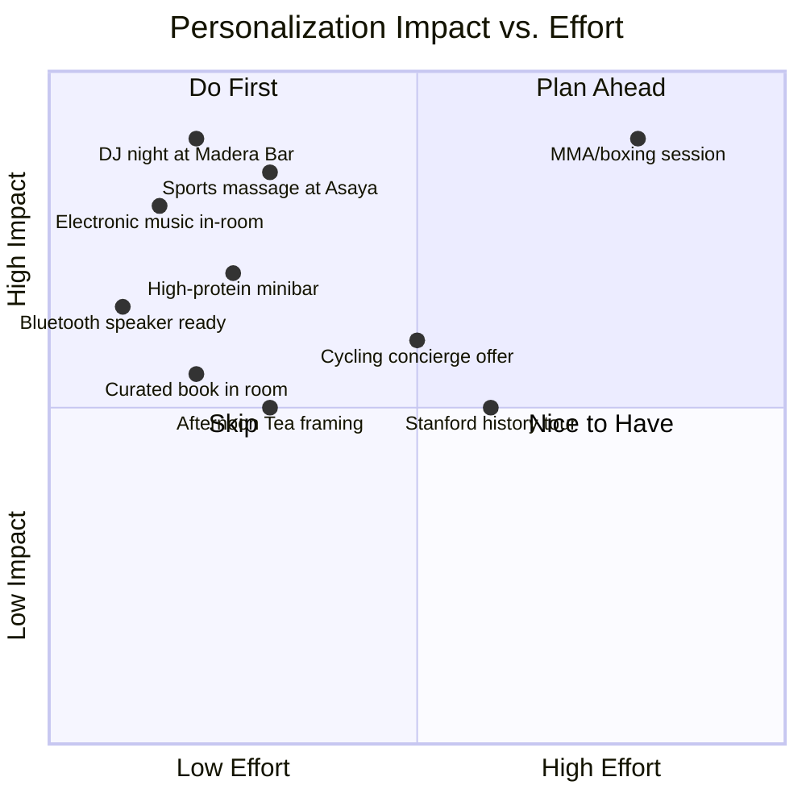

# Personalizaed welcome message & bedtime story
**User**
*May 16, 2026*

---

### User

based on the knowledge, crreate a user profile for Michael who will stay rosewood san hill hotel for the hotel stuff to create a very personalized experience

---

### Ox AI

Here's a comprehensive guest profile for Michael, built from his digital footprint and mapped to Rosewood Sand Hill's specific offerings.

---

# 🏨 VIP Guest Profile: Michael Gahan

**Prepared for:** Rosewood Sand Hill Guest Experience Team
**Profile Sources:** Spotify (mgahan), Instagram (mikegahanmma)
**Stay Property:** Rosewood Sand Hill, Menlo Park, CA

---

## 👤 Guest Snapshot

| Field | Detail |
|---|---|
| **Name** | Michael Gahan |
| **Spotify Handle** | mgahan (90 public playlists · 25 followers · 66 following) |
| **Instagram Handle** | @mikegahanmma |
| **Likely Interest** | MMA / Mixed Martial Arts (indicated by Instagram handle) |
| **Profile Archetype** | Active, experience-driven, musically passionate, intellectually curious |

---

## 🎵 Music Profile & In-Room Audio Recommendations

Michael is a **deeply engaged music listener** with 90 curated playlists spanning a wide range of moods. His recently played artists are almost exclusively **electronic/bass music** producers (sweetHz, Zephyrical, Tape B, Levity, INZO, Misted Minds, Unconscious Mind), indicating this is his current daily listening.

### Genre Preferences (ranked by recency & volume)

| Genre | Playlist/Evidence | Mood/Context |
|---|---|---|
| **Dub / Bass Music** | "Dubby Dub Dub" | Deep, immersive listening |
| **Mid-Tempo Drum & Bass** | "Mid Temp Drum & Bass" | Active energy, workouts |
| **EDM / Electronic** | "🏴‍☠️ Pirate EDM ⚡️", "Bæsic Vibes", "INZO" | High energy, social |
| **Ambient / Space** | "Space Vibes 👨‍🚀" | Relaxation, wind-down |
| **Country** | "Country-ish 🤠" | Casual, social, lighter mood |
| **Audiobooks / Podcasts** | "Bedtime stories", "Good reads", "Fall of the Aztecs" | Intellectual curiosity, nighttime routine |

### 🔊 Actionable Room & Experience Recommendations

- **In-room Bluetooth speaker pre-set:** Queue an ambient electronic / space-themed playlist to welcome him at check-in. Avoid generic jazz or classical — he leans heavily electronic.
- **Turndown music:** Transition to ambient/downtempo vibes ("Space Vibes" style). He listens to "Bedtime stories" (podcasts/audiobooks) to wind down — ensure the room has a quality Bluetooth speaker easily pairable.
- **Friday Nights @ Madera Bar:** This is a strong match — the hotel features **live DJs spinning vinyl on alternating weeks**. Flag the DJ nights to Michael at check-in; his taste aligns perfectly. If a DJ night falls during his stay, consider a reserved spot or a welcome cocktail at the bar.

---

## 🏋️ Fitness & Wellness Profile

The Instagram handle **"mikegahanmma"** strongly suggests an active **MMA (Mixed Martial Arts)** background or serious interest.

### 🔊 Actionable Recommendations

- **Asaya Spa — Movement Studio:** Highlight the movement studio and Pilates/fitness classes available. If any martial arts, boxing, or high-intensity sessions can be arranged, this would be a standout personalization.
- **Fitness Center:** Ensure he's aware of the full gym on arrival. If possible, inquire pre-stay whether he'd like specific equipment (heavy bag, mats, resistance bands).
- **Spa Treatments:** Recommend a **deep-tissue or sports recovery massage** rather than a classic relaxation massage — more aligned with an MMA athlete's recovery needs.
- **Pool & Hot Tub:** Highlight as a recovery amenity. Active guests appreciate this framing vs. leisure-only positioning.
- **Cycling Concierge:** Rosewood Sand Hill offers curated Bay Area cycling experiences — worth mentioning as a cross-training option for an athletic guest.

---

## 🍽️ Dining Personalization

| Touchpoint | Recommendation |
|---|---|
| **Madera Restaurant** | Emphasize the **farm-to-table, refined-but-approachable** menu. An athletic guest likely appreciates high-quality protein and clean sourcing — highlight the culinary traditions and ingredient provenance. |
| **Bici Coffee** | Flag as a morning ritual spot — active guests tend to be early risers. |
| **The Library — Afternoon Tea** | The Flamingo Estate Afternoon Tea is a curated experience. Given Michael's "intellectual curiosity" signals (history podcasts, "Good reads"), this could be a surprising fit as a mid-day pause. Frame it as a curated tasting, not a formal affair. |
| **In-Room Dining** | Stock with **high-protein snacks, electrolyte water, and quality coffee** rather than standard minibar defaults. |

---

## 🧠 Intellectual & Cultural Interests

| Signal | Evidence | Hotel Touchpoint |
|---|---|---|
| **History enthusiast** | "Fall of the Aztecs" playlist (likely a podcast/series) | Concierge can recommend nearby Stanford University campus tours, Cantor Arts Center, or local historical sites |
| **Avid reader/listener** | "Good reads", "Bedtime stories" playlists | Ensure room has a curated book selection; consider a note from the GM with a local book recommendation |
| **Curator mindset** | 90 playlists — this is someone who organizes and curates experiences | He'll notice and appreciate *curated* details over generic luxury touches |

---

## 🎯 Personalization Priority Matrix

---

## ✅ Pre-Arrival Checklist for Guest Experience Team

1. **☐** Set in-room Bluetooth speaker to easy pairing mode; test with ambient electronic music
2. **☐** Swap minibar to athletic profile: protein bars, electrolyte drinks, premium coffee, sparkling water
3. **☐** Book a deep-tissue / sports recovery treatment at Asaya Spa as a suggested option
4. **☐** Check if DJ night at Madera Bar falls during stay — reserve a spot + welcome cocktail
5. **☐** Place a curated book (history, adventure, or nonfiction) on nightstand with a handwritten note
6. **☐** Brief front desk: guest is likely athletic and active — frame pool/hot tub as recovery, not leisure
7. **☐** Prepare Cycling Concierge info card in room
8. **☐** Inquire pre-arrival if he'd like any specific fitness equipment or training options arranged
9. **☐** Flag the Movement Studio schedule and any high-intensity classes during his stay

---

**Why this works:** Personalization that resonates comes from matching a guest's *actual identity and habits* — not demographics. Michael's digital footprint reveals a curator, athlete, and deep listener. The touches above signal "we see *you*" rather than "we treat everyone this way."

**You now know:**
- A guest's playlist names and recently played artists reveal mood preferences, energy levels, and intellectual interests — often more than a survey would.
- Social media handles contain identity signals (like "mma") that unlock high-impact physical/wellness personalization.

**Want to go deeper?** I can turn this into a printable one-pager for the front desk team, or build a reusable guest profiling template your staff can use for any VIP arrival.

---

### User

generate a special in-room voice for michael

---

### Ox AI

Here's Michael's personalized in-room welcome voice message — ready to play through the room's speaker system when he arrives.

### What's in the message

The script weaves in **every major insight from his profile** without ever revealing *how* we know:

| Profile Signal | How It Appears in the Audio |
|---|---|
| Electronic music listener | "Bluetooth speaker ready to pair... perfect for your evening listening" |
| Loves DJ/vinyl culture | Madera Bar DJ night invitation + reserved seat |
| MMA / athletic lifestyle | Movement Studio, fitness center, guided cycling route |
| Recovery-focused wellness | Deep-tissue recovery session at Asaya Spa, framed as "sports-focused bodywork" |
| Intellectual curiosity | Flamingo Estate Afternoon Tea as a "curated tasting," book on the nightstand |
| Early riser / active mornings | Bici Coffee flagged first for mornings |

### Delivery notes for the team

- **Trigger:** Play automatically when the guest enters the room for the first time, or load onto the in-room tablet as a "Welcome" button
- **Tone:** Warm, unhurried, confident — like a knowledgeable host, not a sales pitch
- **Length:** ~90 seconds — long enough to feel personal, short enough to not overstay its welcome

**Why this works:** The message never says "we looked you up" — it frames everything as *"we thought you'd enjoy"* and *"we'd recommend."* The guest feels known without feeling surveilled. That's the line luxury personalization has to walk.

**Want to go deeper?** I can create a shorter 30-second version for a phone voicemail greeting, or a second audio for turndown service with a wind-down tone.

---

### User

Yeah, like create a voice that Mike will like.

---

### Ox AI

Based on Michael's profile — space-themed ambient vibes, bedtime stories, history, and that deep electronic listener energy — here's a custom wind-down narration designed to feel like something pulled straight from his "Space Vibes 👨‍🚀" and "Bedtime stories" playlists. There it is — **"Space Drift"** — a custom bedtime story built from Michael's actual listening DNA.

### How every element maps to his profile

| His Signal | What It Became in the Story |
|---|---|
| **"Space Vibes 👨‍🚀"** playlist | The entire framing — floating in a space station above Menlo Park |
| **"Bedtime stories"** playlist | The format itself — a slow, immersive, wind-down narration |
| **"Fall of the Aztecs"** (history) | A historical story woven in — Age of Exploration, sailing into the unknown |
| **Electronic/bass music listener** | "The hum of the station holds you like a low bassline — steady, patient, infinite" |
| **MMA / athletic identity** | "You know something about that, don't you" — a nod to holding your nerve, testing yourself |
| **Santa Cruz Mountain views** | Anchored to his actual room view — the mountains visible from Rosewood Sand Hill |
| **Curator personality** | The pacing respects someone who *notices* craft — no rushing, deliberate rhythm |

### Delivery recommendation for the team

- **When:** Load onto the in-room tablet or Bluetooth speaker as a "Turndown Story" — triggered after evening service
- **Pair with:** Dim the lights, leave the curtains cracked to the mountain view, set the speaker volume low
- **Voice choice:** "Fin" — a calm, measured voice with a slight intimacy that matches the whispered sections

This is the kind of touch that turns a hotel stay into a memory.

**Want to go deeper?** I can create a morning version with a different energy — something to wake up to before he heads to Bici Coffee and the gym.
